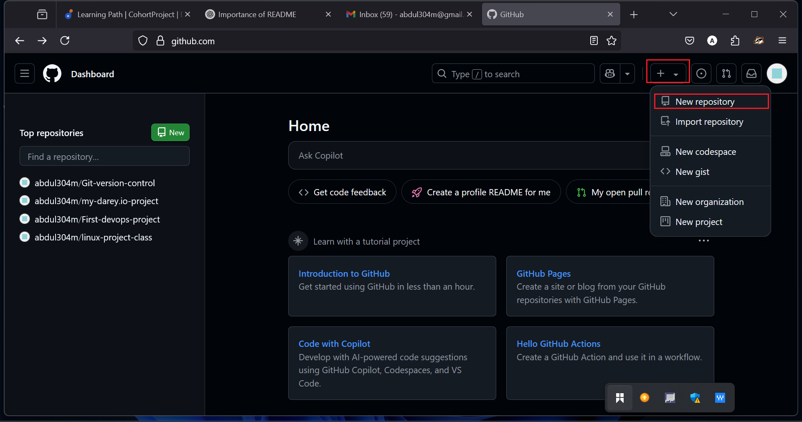
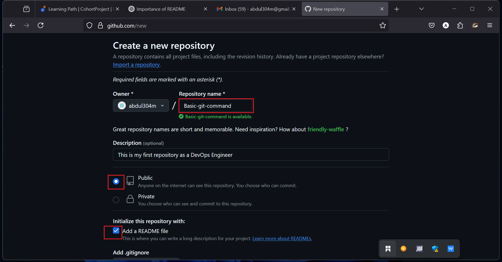
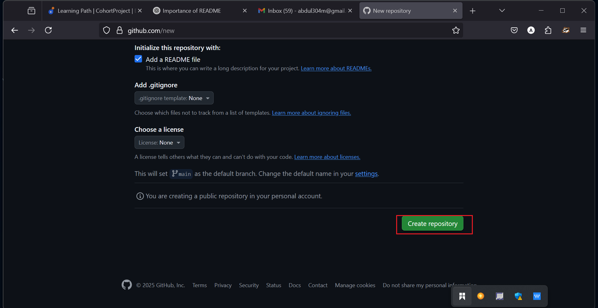
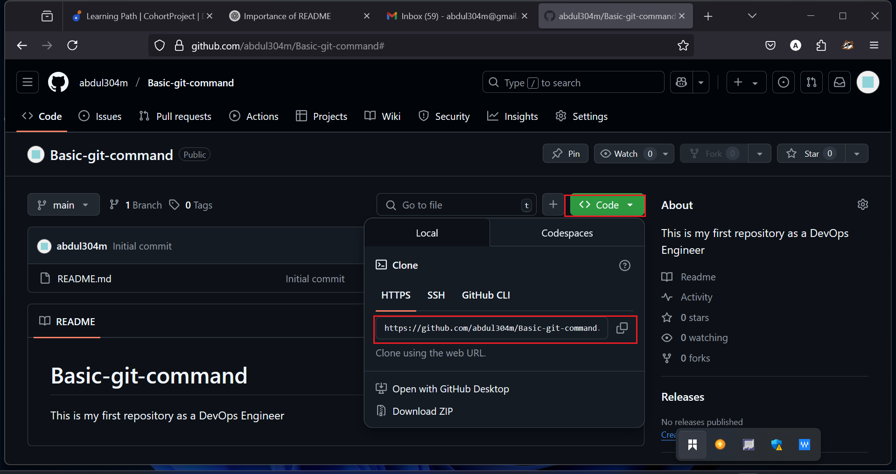
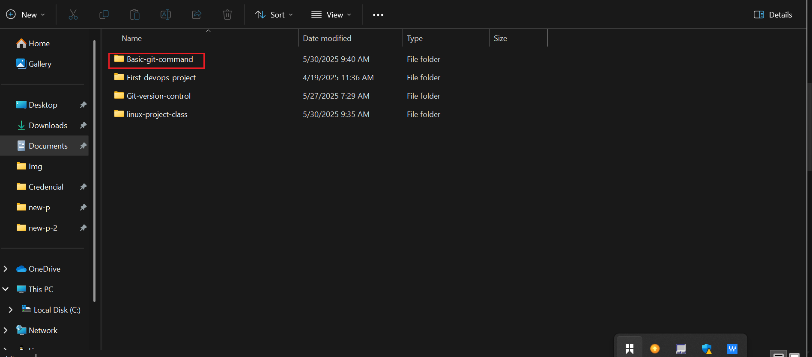
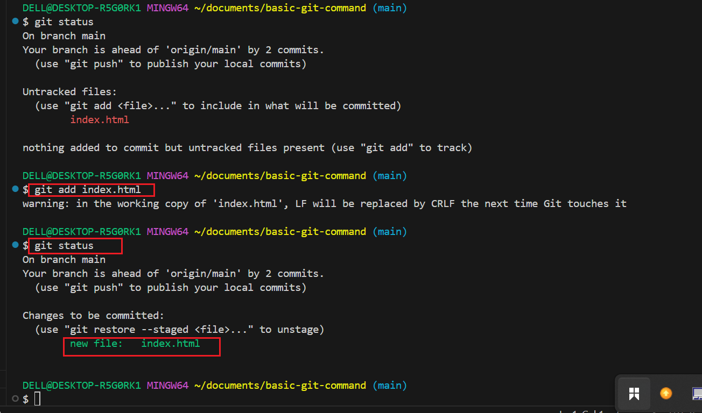
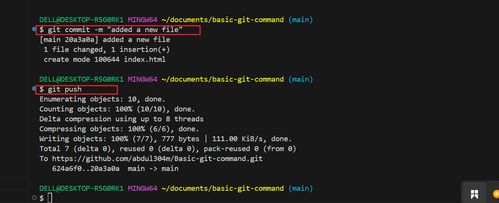
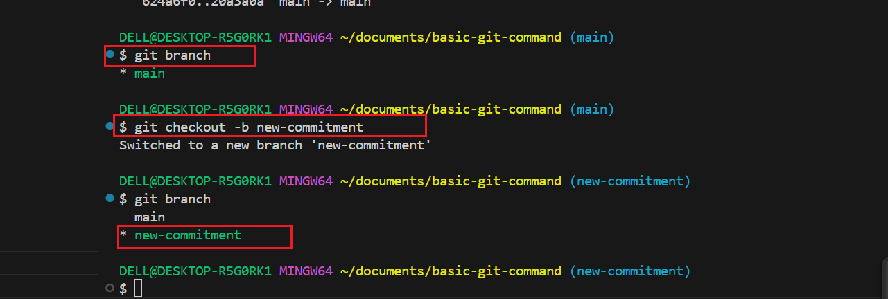

# Basic-git-command
This is my first repository as a DevOps Engineer

In this mini-project we will explain a step by step process of how you will duplicate your workflow using Git and Github. This include installation 
of Git, setting up a Github repository, cloning the repository, creating branches, making changes, and merging those changes back into the main branch.

 ## part 1: 
 1. Install Git :

. For you to install Git successful, you are to visit the  official Git website https://git-scm.com/downloads and download the version of Git for your operating system.And follow the installation instruction .

2. Create a Github repository :

. Sign up if you have not register or log in to Github.

. Click the "+" icon in the top right-conner and select 'New repository."

. Name your repository (eg. "Basic-git-command") and innitialize it with a README file.

. Click create repository and you are good to go and start your work with the repository you have just created.

 

3. Clone repository:
The next step is to clone the repository you have created in your Terminal. How do you do that?. On your repository's page on Github, click the "code' botton and click the HTTPS URL.

. Open your Terminal or Command prompt.

. Create a folder with thge same name you have created of your repository in the folder where you are storing your work. For example in the Desktop folder on your laptop, you click on Documents folder then cearte a folfer where you will be keeping your work and give it a name eg.darey.io-training. Then inside this folder, create the new folder thta you want clone with the same name in your repository.

. Clone the repository from Github by copying HTTPS of the repository using " git clone [and paste the URL copied from Github]

. Since you just clonned your repository, your branch is main.

. Navigate into the repository you clonned by runnung thius command " cd basic-git-command/"

. Create an empty file "index.html". you can do that by running this on your Terminal"echo " " > index.html".

. Add the following content bellow "This is the admin creating an index.html file for Tom and Jerry" you can do this by running this command "echo "THis is the Admin creating an index.html file for Tom AND jerry".

. Check changes has niot been staged. you can do this by running this command " git status"

. Stage changes. you can do this by running this command "git add index.html"

. comfirm changes have been staged for commit. you can do this by running this command "git status" And after staging the changes, the file name will appear in Green in the Terminal output. This color change sugnifies that the file has been successfully staged.

. Commit changes: you can commit your changes by running this command "git commit -m "added new file"

. Push main branch to Github: pushing your manin branch to Github is done by running this command "git push"

## Part 2: Simulating Tom and Jerry's work.

To simulate both Tom and Jerry working on the same laptop, you will switch between two branches, making chnges as each character.

1. Tom's work

. Navigate to the project directory you just cloned. And you can do this by running this command "cd basic-git-command". this moves you into the folder containing the cloned Github repository on your local machine.

. check the current branch: This shows you a list of all branches in your local repository. initially you will see only the "main"branch because thats the defaults starting point.And you can do this by running thus command "git branch".

. Create a new branch for Tom's work: "git chechout -b new-commitment" this command can help you craete new folder and at the same time switch to that new folder.

. Since you already created a file "index.html" in the main branch, the file will also exist in the new-branch "new-commitmnt". So you just open the file and add this content "This Tom adding navigation to the AI-website , running this command "echo "This Tom adding navigation to the AI-website" > index.html".

. check changes has not been stage by using "git status"

. Stage Tom's changes by using "git add index.html" and run "git status" to comfirm changes have been staged.and you will see the file appear in green color.

. Commit Tom's changes : by running "git commit -m "git commit -m "adding file on branch folder".

. Push Tom's branch to Github: by running "git push --set-upstream origin new-commitment" 

. After completing Tom's workflow. you will now simulate jerry's contribution to the project. To do this you will :

1.Jerry's work:

. switch back to the main branch by running this coomand "git checkout main.".

. pull the latest changes: by running " git pull origin new-commitment". This ensure that you have the latest update from the repository including Tom's merge changes.

. create new branch for jerry's work: by running this command "git checkout -b Jerrys feature".

. open index.html and some information eg "echo "jerry's changes to the project" > index.html".

. Stage jerry's change : by running this command "git add index.html"

.commit jerry's changes: by running this command " git commit -m "jerry's added new feature'.

. push jerry's branch to Github: by running this command " git push -u origin jerry's-feature

This is steo by step on how you could simulate yur workflow using git and github.

