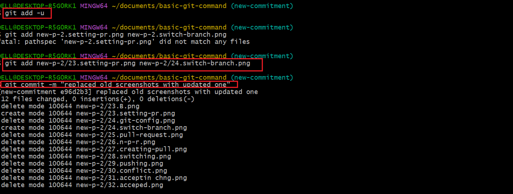

## Git-Branching And Merging.
In the previous project we explained how yu can craete a branch, which you use to add new feature or fix a bugs. In this project, we shawcase how you work on different features,fixes or experiment without affecting the main codebase until you rae ready and also explain how you can merge your changes.

- After your team members have pushed their work into their respective branches, you can also review and merge these changes into the main project. Just like this example of Tom and jerry we are going to used.

## The process of merging changes

1. the first step is to create a pull request. Pull request is afeature used in Github which allows you to notify team members about the changes you have pushed ina repository. Then how could you craete a pull request?. we do that by navigating into our repository and switch to the branch that Tom has been working on. In this case "New-commitment branch"
 and then click on contribute and press on open pull request..

- Immediately after we pressed on open pull request, Github took us to a new page where we initaited a pull request, where we provided a title and description for the pull request.Github automatically select the main branch as the base and our recently pushed branch as the compare branch. 

-  but before we create the pull request, we reviewed the work of Tom to ensure that everything is intake. And we did that by running this command on our bash. "git status", and stage our work by running this command "git add -u" and then commit it.  and . And then we go ahead and merge his work. .

## Updating Jerrys Branch Latest Changes.

1. We followed the same process in updating jerrys branch just like we did when updating Tom's own branch. ,. but in the process we encounter conflict which we have to resolved before moving forward, using web-Editor. . By clicking on resolve conflict. After we resolved the issue we then pressed "mark as resolve" 

- Then On the Terminal we run a command " git checkout jerrys-feature" which help us enter into the branch, and the run "git pull origin main" this command help us fetches the changes from the main branch which now has Tom's changes and merges them into jerrys-feature branch. Run git pull and push. 

- Then we go back to our repository and confirm the merge and it succcesfully merged. .

